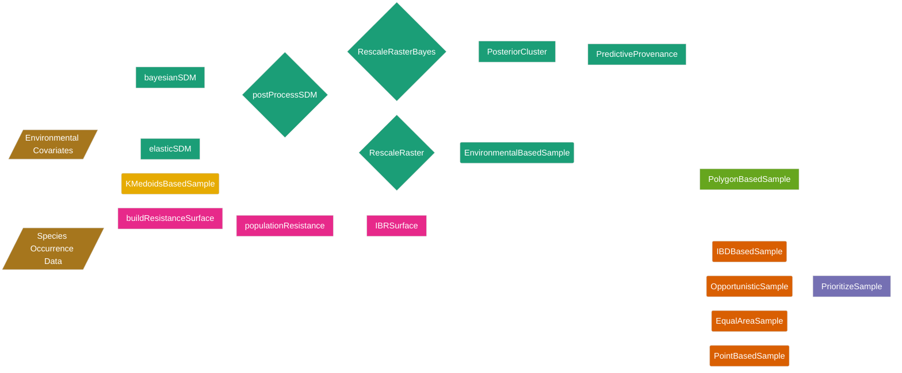

---
output:
  md_document:
    variant: gfm
html_preview: false
title: "safeHavens: Ex Situ Plant Germplasm Sampling Strategies"
description: "R package providing sampling schemes for germplasm curators to prioritize field collection efforts for ex situ plant conservation"
---

<!-- README.md is generated from README.Rmd. Please edit that file -->

```{r, echo = FALSE, results='asis'}
cat(
  badger::badge_github_actions('sagesteppe/safeHavens'), '\n',
	badger::badge_codefactor('sagesteppe/safeHavens'), '\n',
	badger::badge_repostatus("Active"), '\n',
  badger::badge_doi("10.5281/zenodo.18149377", color = 'orange'), "\n",
  badger::badge_codecov("sagesteppe/safeHavens", branch = "main"), "\n"
)
```

# safeHavens 

The goal of this package is to provide germplasm curators with easily referable spatial data sets to help prioritize field collection efforts. 

## Overview
It provides functionality for seven sampling schemes which various curators are interested in, many of which are likely to outperform others for certain species or areas. 
The package also creates species distribution models, but with the goal of germplasm sampling, rather than predicting ranges at fine resolutions, or making inference; if you are interested in this functionality R has several dozen other packages which are tailored for these purposes. 

## Description
This package helps germplasm curators communicate areas of interest to collection teams for them to collect new material for accession. It provides seven different sampling approaches for curators to choose from for each individual taxon they hope to process. 

## Installation
`safeHavens` is available only on github. 
It can be installed using `remotes` or `devtools`
```
install.packages('remotes') 
remotes::install_github('sagesteppe/safeHavens')
```

Once installed it can be attached for use like any other package from github or CRAN
```
library(safeHavens)
```

## Usage

`safeHavens` has only seven user facing functions for generating the sampling schemes.  

### Available Sampling Schemes

The following table shows the eight sampling approaches available in safeHavens, with their computational complexity (Comp.) and environmental data complexity5 (Envi.): L = Low, M = Medium, H = High.

|        Function           |              Description               | Comp.| Envi.|
|---------------------------|----------------------------------------|------|------|
| `PointBasedSample`        | Creates points to make grids over area |  L   |   L  |
| `EqualAreaSample`         | Breaks area into similar size pieces   |  L   |   L  |
| `OpportunisticSample`     | Using PBS with existing records        |  L   |   L  |
| `IBDBasedSample`          | Breaks species range into clusters     |  H   |   L  |
| `IBRSurface`              | Breaks species range into clusters     |  H   |   M  |
| `PolygonBasedSample`      | Using existing ecoregions or STZs      |  L   |   H  |
| `EnvironmentalBasedSample`| Uses correlations from SDM to sample   |  H   |   H  |
| `KMedoidsBasedSample`     | For rare species with known occurrences|  M   |   M  |
| `PosteriorCluster`        | Uses posteriors from an SDM to cluster |  H   |   H  |

```{r Install Package, message=FALSE, eval = F}
remotes::install_github('sagesteppe/safeHavens') 
# devtools::install_github('sagesteppe/safeHavens')
```

An overview of the functionality in the package is below. 



## Acknowledgements

Edzer Pebesma, and Krzysztof Dyba for help with seamless installations on Ubuntu, and getting the pkgdown website running.