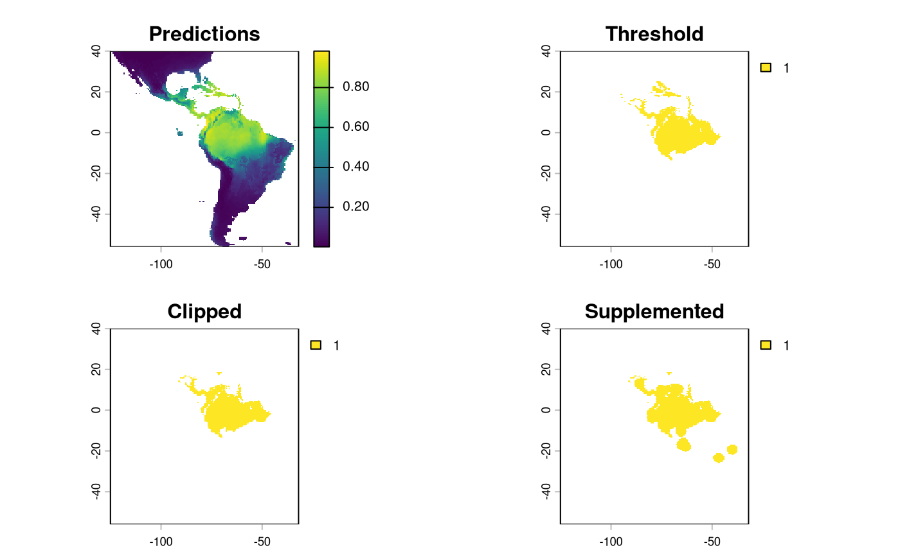

# Getting Started

This vignette showcases the different sampling designs applied to the
same species.

### set up

`safeHavens` can be installed directly from github.

``` r
# remotes::install_github('sagesteppe/safeHavens') 
```

``` r
library(safeHavens)
library(sf) ## vector operations
library(terra) ## raster operations
library(spData) ## basemap data
library(dplyr) ## general data handling
library(ggplot2) ## plotting 
library(patchwork) ## multiplots
set.seed(23) 

planar_proj <- "+proj=laea +lat_0=-15 +lon_0=-60 +x_0=0 +y_0=0 +datum=WGS84 +units=m +no_defs"
```

### Defining a Species Range or Domain for Sampling

The core of `safeHavens` sampling schemes is the species range or
domain. Curators can sample across the entire range or focus on a
region, such as a country or ecoregion. Both approaches are supported.
We show how to use occurrence data to define species ranges across
various sampling schemes.

Below we will use `sf` to simply buffer occurrence points to create a
species range across multiple South American nations.

``` r
x <- read.csv(file.path(system.file(package="dismo"), 'ex', 'bradypus.csv'))
x <- x[,c('lon', 'lat')]
x <- sf::st_as_sf(x, coords = c('lon', 'lat'), crs = 4326)
x_buff <- sf::st_transform(x, planar_proj) |>
  # we are working in planar metric coordinates, we are
  # buffer by this many / 1000 kilometers. 
  sf::st_buffer(125000) |> 
  sf::st_as_sfc() |> 
  sf::st_union()

plot(x_buff)
```


Alternatives include creating a convex hull for widespread species (see
‘Worked Example’) or masking a binary SDM surface as the domain (see
below and ‘Species Distribution Model’).

## Prep a base map

We will use the `spData` package which uses
[naturalearth](https://www.naturalearthdata.com/) for it’s `world` data
and is suitable for creating maps at a variety of resolutions.

``` r
x_extra_buff <- sf::st_buffer(x_buff, 100000) |> # add a buffer to 'frame' the maps
  sf::st_transform(4326)

americas <- spData::world
americas <- sf::st_crop(americas, sf::st_bbox(x_extra_buff)) |>
  dplyr::select(name_long)
Warning: attribute variables are assumed to be spatially constant throughout
all geometries

bb <- sf::st_bbox(x_extra_buff)

map <- ggplot() + 
  geom_sf(data = americas) + 
  theme(
    legend.position = 'none', 
    panel.background = element_rect(fill = "aliceblue"), 
    panel.grid.minor.x = element_line(colour = "red", linetype = 3, linewidth  = 0.5), 
    axis.ticks=element_blank(),
    axis.text=element_blank(),
    plot.background=element_rect(colour="steelblue"),
    plot.margin=grid::unit(c(0,0,0,0),"cm"),
    axis.ticks.length = unit(0, "pt"))+ 
  coord_sf(xlim = c(bb[1], bb[3]), ylim = c(bb[2], bb[4]), expand = FALSE)

rm(x_extra_buff, americas)
```

## Running the Various Sample Design Algorithms

Now that we have some data which can represent species ranges, we can
run the various sampling approaches. The table in the introduction is
reproduced here.

| Function                   | Description                             | Comp. | Envi. |
|----------------------------|-----------------------------------------|-------|-------|
| `PointBasedSample`         | Creates points to make pieces over area | L     | L     |
| `EqualAreaSample`          | Breaks area into similar size pieces    | L     | L     |
| `OpportunisticSample`      | Using PBS with existing records         | L     | L     |
| `KMedoidsBasedSample`      | Use ecoregions or STSz for sample       | L     | M     |
| `IBDBasedSample`           | Breaks species range into clusters      | H     | M     |
| `PolygonBasedSample`       | Using existing ecoregions to sample     | L     | H     |
| `EnvironmentalBasedSample` | Uses correlations from SDM to sample    | H     | H     |

*Note in this table ‘Comp.’ and ‘Envi.’ refer to computational and
environmental complexity respectively, and range from low (L) through
medium to high.*

### PointBasedSample

`PointBasedSample` selects a set of regularly spaced points across the
domain and assigns each point’s cluster to the area nearest to it. This
strictly spatial approach relies on even spacing as its main
differentiator. It will work very well for common species without many
gaps in their distributions.

``` r
pbs <- PointBasedSample(x_buff, reps = 50, BS.reps = 333)
pbs.sf <- pbs[['Geometry']]

pbs.p <- map + 
  geom_sf(data = pbs.sf, aes(fill = factor(ID))) + 
#  geom_sf_label(data = pbs.sf, aes(label = ID), alpha = 0.4) + 
  labs(title = 'Point') + 
  coord_sf(expand = F)

pbs.p
```


### EqualAreaSample

Perhaps the simplest method offered in safeHavens is `EqualAreaSample`.
It creates many points (`pts`, defaulting to 5000) within our target
domain and subjects them to k-means clustering, where the groups are
specified by `n`, our target number of collections. Points in each group
are merged into polygons that fill the geographic space, intersected
with the species’ range, and their areas are measured. This runs
multiple times (default: 100 reps), and the set with the smallest
variance in polygon size is selected

This process stands apart from point-based sampling: instead of growing
clusters from a set of regular points, EqualAreaSample uses many input
points and relies on area-balancing clustering. This allows for more
equally sized regions.

``` r
eas <- EqualAreaSample(x_buff, planar_proj = planar_proj) 

eas.p <- map + 
  geom_sf(data = eas[['Geometry']], aes(fill = factor(ID))) + 
#  geom_sf_label(data = eas.sf, aes(label = ID), alpha = 0.4) + 
  labs(title = 'Equal Area') + 
  coord_sf(expand = F)
eas.p
```


The results look quite similar to `PointBasedSample`.

### OpportunisticSample

Users may be interested in how they can embed their existing collections
into a sampling framework. The function `OpportunisticSample` makes a
few minor modifications to the point-based sample and designs it around
existing collections. It may not perform well if collections are close
together, but, as the saying goes, “a bird in hand is worth two in the
bush”. As we have observed, the previous sampling schemes have produced
somewhat similar results, so we used the `PointBasedSample` as the
framework for embedding in this function.

``` r
exist_pts <- sf::st_sample(x_buff, size = 10) |> 
   sf::st_as_sf() |> # ^^ randomly sampling 10 points in the species range
   dplyr::rename(geometry = x)

os <- OpportunisticSample(polygon = x_buff, n = 20, collections = exist_pts, reps = 50, BS.reps = 333)

os.p <- map + 
  geom_sf(data = os[['Geometry']], aes(fill = factor(ID))) + 
#  geom_sf_label(data = os.sf, aes(label = ID), alpha = 0.4) + 
  geom_sf(data = exist_pts, alpha = 0.4) + 
  labs(title = 'Opportunistic') + 
  coord_sf(expand = F)

os.p
```


Here, the grids have been aligned around the existing collections. The
results from this function can lead to some oddly shaped clusters, but
*a bird in hand is worth two in the bush.*

### Isolation by Distance Based Sample

Isolation by Distance is the fundamental idea behind this package. This
function applies Isolation by Distance (IBD) without added parameters,
creating clusters based solely on spatial genetic structure, not
geographic spacing or area balancing, which distinguishes it from
previous methods.

Note that this function requires a raster, rather than a vector, input.

``` r
files <- list.files( 
  path = file.path(system.file(package="dismo"), 'ex'),
  pattern = 'grd',  full.names=TRUE ) 
predictors <- terra::rast(files) 

x_buff.sf <- sf::st_as_sf(x_buff) |> 
  dplyr::mutate(Range = 1) |> 
  sf::st_transform( terra::crs(predictors))

# and here we specify the field/column with our variable we want to become an attribute of our raster
v <- terra::rasterize(x_buff.sf, predictors, field = 'Range') 

# now we run the function demanding 20 areas to make accessions from, 
ibdbs <- IBDBasedSample(
    x = v, 
    n = 20, 
    fixedClusters = TRUE, 
    template = predictors, 
    planar_proj = planar_proj
    )

ibdbs.p <- map + 
  geom_sf(data = ibdbs[['Geometry']], aes(fill = factor(ID))) + 
#  geom_sf_label(data = os.sf, aes(label = ID), alpha = 0.4) + 
  labs(title = 'IBDistance') + 
  coord_sf(expand = F)

## for the sake of comparing areas below, we will intersect this to the same extents as the earlier surfaces. 
ibdbs_crop <- sf::st_intersection(ibdbs[['Geometry']], sf::st_union(x_buff.sf))
ibdbs.p2 <- map + 
  geom_sf(data = ibdbs_crop, aes(fill = factor(ID))) + 
#  geom_sf_label(data = os.sf, aes(label = ID), alpha = 0.4) + 
  labs(title = 'IBDistance') + 
  coord_sf(expand = F)

ibdbs.p
```


Because results are derived from rasters, clusters have straight lines
and 90-degree corners. Despite the raster effects, cluster borders look
more natural, and polygons align better with classes than previous
methods.

### Isolation by Resistance

This workflow requires a couple of steps. We have a dedicated vignette
for Isolation by Resistance with full details. Here, we will just load
the data you get when you run that vignette.

``` r
ibr <- sf::st_read(
  file.path(system.file(package="safeHavens"), 'extdata', 'IBR.gpkg'), 
  quiet = TRUE)

ibr.p <- map + 
  geom_sf(data = ibr, aes(fill = factor(ID))) +
  labs(title = 'IBResistance') + 
  coord_sf(expand = F)

[1m
[22mCoordinate system already present.

[36mℹ
[39m Adding new coordinate system, which will replace the existing one.
```

### PolygonBasedSample

This method is widely used for native seed collection in North America.
However, I am not sure exactly how practitioners implement it, or
whether the application formats are consistent among practitioners! For
these reasons, a few different sets of options are supported for a user.

For general usage, two parameters are always required `x`, which is the
species range as an sf object, and `ecoregions`, the sf object
containing the ecoregions of interest. The ecoregions file does not need
to be subset to the range of x quite yet - the function will take care
of that. Additional arguments to the function include, as usual, `n`,
which specifies how many accessions we are looking for in our
collection. Two additional arguments relate to whether we are using
Omernik Level 4 ecoregions data or ecoregions (or biogeographic regions)
from another source. These are `OmernikEPA` and `ecoregion_col`. If you
are using the official EPA release of ecoregions, then both of these are
optional. If you are not using the EPA product, then both should be
supplied, but only the `ecoregion_col` argument is totally necessary.
This column should contain the unique name of the highest-resolution
ecoregion you want to use from the dataset. For many data sets, such as
our example, we call ‘neo_eco’; this may be the only field with ecolevel
information!

``` r
neo_eco <- sf::st_read(
  file.path(system.file(package="safeHavens"), 'extdata', 'NeoTropicsEcoregions.gpkg'), 
  quiet = TRUE) |>
  dplyr::rename(geometry = geom)

head(st_drop_geometry(neo_eco)[,c('Provincias', 'Dominio', 'Subregion')]) |>
  knitr::kable()
```

| Provincias                | Dominio      | Subregion                      |
|:--------------------------|:-------------|:-------------------------------|
| Araucaria Forest province | Parana       | Chacoan                        |
| Atacama province          | NA           | South American Transition Zone |
| Atlantic province         | Parana       | Chacoan                        |
| Bahama province           | NA           | Antillean                      |
| Balsas Basin province     | Mesoamerican | Brazilian                      |
| Caatinga province         | Chacoan      | Chacoan                        |

``` r

x_buff <- sf::st_transform(x_buff, sf::st_crs(neo_eco))
ebs.sf <- PolygonBasedSample(x_buff, zones = neo_eco, n = 20, zone_key = 'Provincias')

# crop it to the other objects for plotting
ebs.sf <- st_crop(ebs.sf, bb)

ebs.p <- map + 
  geom_sf(data = ebs.sf , aes(fill = factor(allocation))) + 
  labs(title = 'Ecoregion') + 
  coord_sf(expand = F)
```

This output differs from the others we will see; here, we have depicted
the number of collections to be made per ecoregion. Because the number
of ecoregions exceeds our requested sample size, the return object can
only take on two values: no collections or one collection.

### EnvironmentalBasedSample

The `EnvironmentalBasedSample` can only be used if you have species
distribution model data. We have included the outputs of the vignette
‘Species Distribution Model’ with the package so they are available to
this vignette.

#### load the SDM predictions

Here, we load the results of the sdm processing from the package data.

``` r
sdModel <- readRDS(
  file.path(system.file(package="safeHavens"), 'extdata',  'sdModel.rds')
  )

sdModel$RasterPredictions <- terra::unwrap(sdModel$RasterPredictions)
sdModel$Predictors <- terra::unwrap(sdModel$Predictors)
sdModel$PCNM <- terra::unwrap(sdModel$PCNM)
```

And load the threshold predictions

``` r
sdm <- terra::rast(
  file.path(system.file(package="safeHavens"), 'extdata',  'SDM_thresholds.tif')
  )
terra::plot(sdm)
```



Once these data are loaded into R, we will scale the rasters (using
`RescaleRasters`), which will serve as surfaces to predict from (this is
also done above!), then we will run the algorithm
(`EnvironmentalBasedSample`). However, before we run the algorithm, we
will need to create a directory (also called a ‘folder’) on our
computers to save the results from the function
`EnvironmentalBasedSample`. Whereas earlier in this vignette we
showcased that the functions generated the species distribution model,
and us saving the results were a two-stage process (e.g. to create the
SDM and associated products we used: `elasticSDM`, `PostProcessSDM`, and
`RescaleRasters`, before finally saving relevant data with
`writeSDMresults`), this function produces both the product and writes
out ancillary data simultaneously. This approach was chosen as this
function is only writing out four objects: 1) The groups as vector
data  
2) and the groups as raster data  
3) The k-nearest neighbours (kNN) model was used to generate these
clusters 4) 1. The confusion matrix associated with testing the kNN
model

``` r
rr <- RescaleRasters( # you may have already done this!
  model = sdModel$Model,
  predictors = sdModel$Predictors, 
  training_data = sdModel$TrainData, 
  pred_mat = sdModel$PredictMatrix
  )

# create a directory to hold the results from EBS real quick. 
# we will default to placing it in your current working directory. 
getwd() # this is where the folder is going to be created if you do not run the code below. 
[1] "/home/runner/work/safeHavens/safeHavens/vignettes"
p <- file.path(path.expand('~'), 'Documents') # in my case I'll dump it in Documents real quick, this should work on 

# optional, intentionally create a directory to hold results
# dir.create(file.path(p, 'safeHavens-Vignette'))

planar_proj <- "+proj=laea +lat_0=-15 +lon_0=-60 +x_0=0 +y_0=0 +datum=WGS84 +units=m +no_defs"

ENVIbs <- EnvironmentalBasedSample(
  pred_rescale = rr$RescaledPredictors, 
  write2disk = FALSE, # we are not writing, but showing how to provide some arguments
  path = file.path(p, 'safeHavens-Vignette'), 
  taxon = 'Bradypus_test', 
  f_rasts = sdm, 
  coord_wt = 2,
  n = 20, 
  lyr = 'Supplemented',
  fixedClusters = TRUE, 
  n_pts = 500, 
  planar_proj = planar_proj,
  buffer_d = 3,
  prop_split = 0.8
  )

## for the sake of comparing areas below, we will intersect this to the same extents as the earlier surfaces. 
ENVIbs_crop <- sf::st_intersection(ENVIbs[['Geometry']], sf::st_union(x_buff.sf))
Warning: attribute variables are assumed to be spatially constant throughout
all geometries

ENVIbs.p <- map + 
  geom_sf(data = ENVIbs_crop, aes(fill = factor(ID))) + 
  #geom_sf_label(data = ENVIbs, aes(label = ID), alpha = 0.4) + 
  labs(title = 'Environmental') + 
  coord_sf(expand = FALSE)

[1m
[22mCoordinate system already present.

[36mℹ
[39m Adding new coordinate system, which will replace the existing one.

ENVIbs.p
```


The function `EnvironmentalBasedSample` can take any of the three binary
rasters created by `PostProcessSDM` as arguments for the template. Here
we showcase the different results from using each of them.


These plots can showcase the differences in results depending on which
of the three input rasters are used. As with all sampling schemes,
results vary widely depending on the spatial extent to which the
functions are applied. Using the SDM output that has undergone
thresholding results in the largest classified area. At first glance,
the results may seem very different, but in Central America, they are
largely consistent because it is near the Andes; large differences do
exist in the Amazon Basin, but even there, some alignment between the
systems is evident. Accordingly, the surface used for a species should
match some evaluation criterion.

Using the threshold raster surface is a very good option if we do not
want to ‘miss’ too many areas, whereas the clipped and supplemented
options may be better suited for scenarios where we do not want to draw
up clusters that lack any populations that can be collected from.

## Comparision of different sampling schemes

So, we have some maps for you to look at! They all *looked* relatively
similar to me when plotted one after another. Let’s plot them together
and see if that’s still the case.

``` r
pbs.p + eas.p + os.p  +  ibdbs.p2 + ibr.p + ENVIbs.p + 
  plot_layout(ncol = 3)
```


The geographic-based samples (here, Point, Equal Area, Opportunistic,
and IBE) are quite similar. In my mind, isolation by distance (IBD)
shows the biggest difference; it makes the most sense by splitting
sampling areas along naturally occurring patches of the species range.

The application of `PolygonBasedSample` to the data is difficult to
evaluate in the same way as the other data sets, but it did identify the
desired sampling regions. We do not show it in this pane. Isolation by
Resistance is similar to IBD; however, it makes fewer splits in Central
America and instead picks them up in Peru.

Relative to IBR, Isolation by Environment tends to split locations
across the Andes and the NW coastal regions of South America. The ranges
are relatively contiguous enough to sensibly sample from. Contiguity of
ranges in this approach can be controlled with the coord_wt argument.
