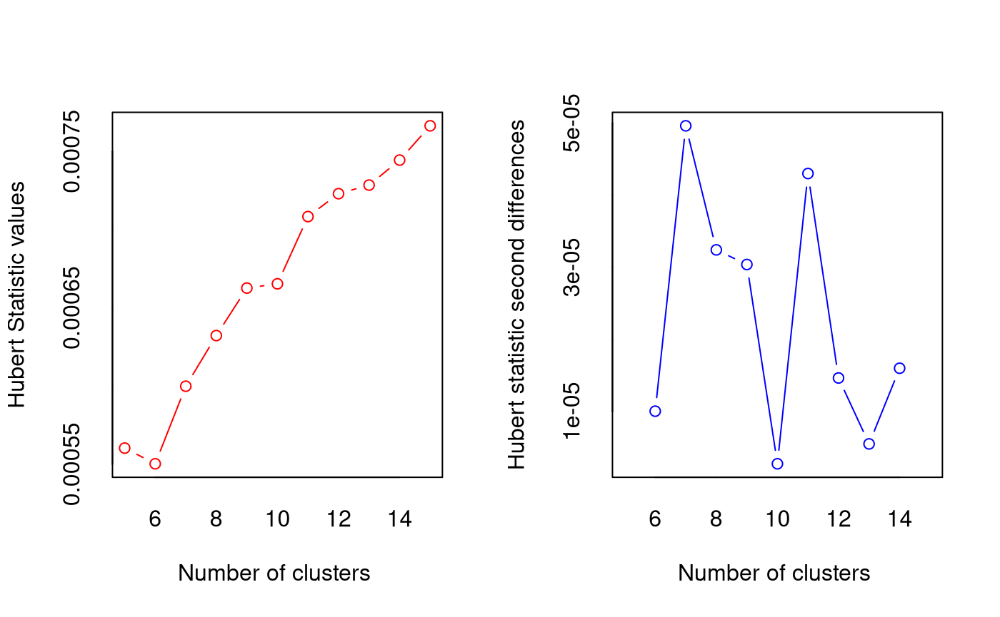
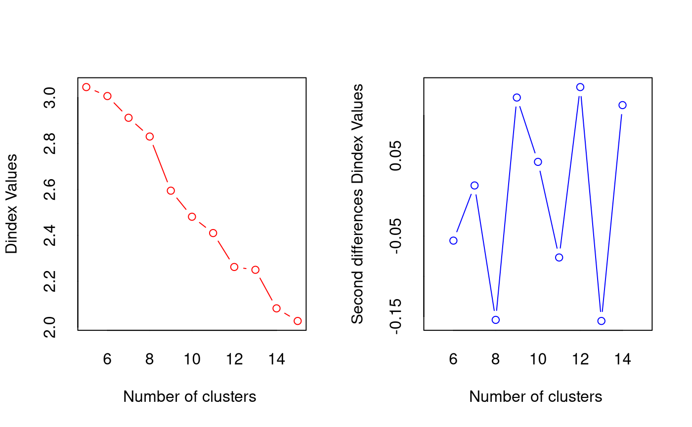
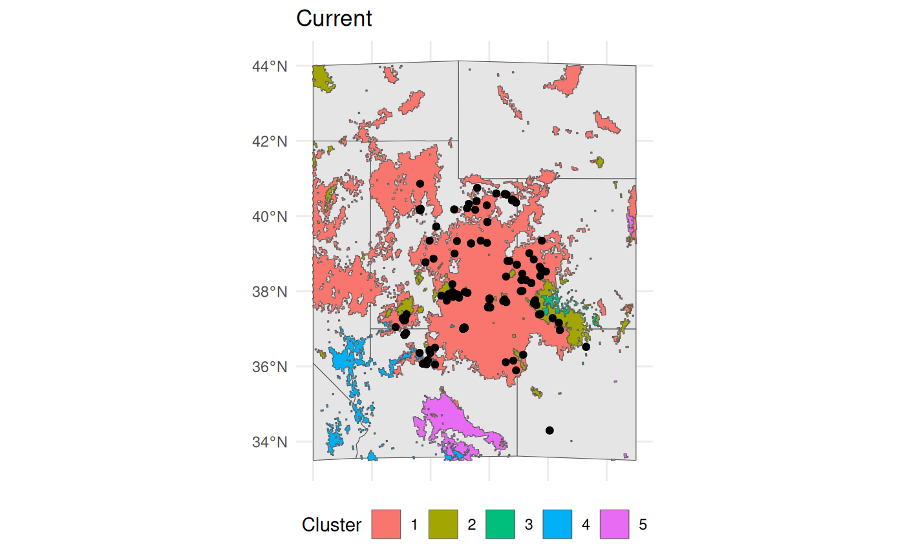

# Predictive Provenance

## Overview

We have already shown that beta-coefficients from species distribution
models can be used in hierarchical clustering to group species
populations into clusters that are more similar and better aligned with
their ecology and climate. While running `EnvironmentalBasedSample`, we
also focus on optimising the species-occupied range using Moran
eigenvector matrix surfaces (MEMs, or PCNMs). In this alternative
approach, we drop the PCNMs from the SDMs, focus solely on environmental
predictors, identify clusters in the **current** environmental space,
and then classify **future** environmental (and geographic) space using
these cluster parameters. This gives us sets of areas with populations
that may be more pre-adapted to future conditions. In addition to
transferring the realised environmental clusters of populations forward,
we also identify novel climate spaces, using MESS (Elith 2010) and
hierarchical clustering. This results in n identified clusters, and we
can traverse the clustering branches to determine which existing
clusters are most similar to the novel clusters.

This is the sole workflow in `safeHavens` that seeks to link current
climates to future scenarios, directly suggest how the size of clusters
may change and where they will shift, and allow a germplasm curator to
identify relevant seed sources for predictive provenancing. The approach
employed here is adequate to guide current collections; decisions on
which sources to use at a particular restoration site are relatively
well defined by tools such as the Seed Lot Selection Tool in North
America.

## Analysis

This workstream leans heavily on the `EnvironmentalBasedSample` workflow
and passes its final objects off to `PolygonBasedSample` for completion.
Please review `Species Distribution Models` and `Getting Started` before
proceeding here. \### Data prep

This workflow will require the `geodata` package; `geodata` is used to
retrieve climate data from various sources as raster data. In this
vignette, we will use [Worldclim](https://www.worldclim.org/). For most
safeHavens users worldwide, this may be your ideal source of climate
data. `geodata` is developed and maintained by Robert Hijman, similar to
`terra`, and `dismo`, which are doing a ton of heavy lifting internally
on our functions.

``` r
library(safeHavens)
library(sf) ## vector operations
library(terra) ## raster operations
library(geodata) ## environmental variables
library(dplyr) ## general data handling
library(tidyr) ## general data handling
library(ggplot2) ## plotting 
library(patchwork) ## multiplots
set.seed(22)
```

For this example, we will leverage GBIF data and shift our geographic
focus to the Colorado Plateau in the Southwestern USA. The Colorado
Plateau is predicted to experience some of the highest rates of climate
change on the planet, and is already an area with considerable native
seed development activities. For our focal species, we will use
*Helianthella microcephala* for no other reason than that it exists in
relatively homogenous portions of the Colorado Plateau - meaning we can
download relatively coarse rasters for the vignettes, and that it has a
stunning inflorescence.

``` r
cols = c('decimalLatitude', 'decimalLongitude', 'dateIdentified', 'species', 'acceptedScientificName', 'datasetName', 
  'coordinateUncertaintyInMeters', 'basisOfRecord', 'institutionCode', 'catalogNumber')

## download species data using scientificName, can use keys and lookup tables for automating many taxa. 
hemi <- rgbif::occ_search(scientificName = "Helianthella microcephala")
hemi <- hemi[['data']][,cols]  |>
  drop_na(decimalLatitude, decimalLongitude) |> # any missing coords need dropped. 
  distinct(decimalLatitude, decimalLongitude, .keep_all = TRUE) |> # no dupes can be present
  st_as_sf(coords = c( 'decimalLongitude', 'decimalLatitude'), crs = 4326, remove = F) 

western_states <- spData::us_states |> ## for making a quick basemap. 
  dplyr::filter(NAME %in% 
    c('Utah', 'Arizona', 'Colorado', 'New Mexico', 'Wyoming', 'Nevada', 'Idaho', 'California')) |>
  dplyr::select(NAME, geometry) |>
  st_transform(4326)

bb <- st_bbox(
  c(
    xmin = -116, 
    xmax = -105, 
    ymax = 44, 
    ymin = 33.5),
    crs = st_crs(4326)
    )

western_states <- st_crop(western_states, bb)
Warning: attribute variables are assumed to be spatially constant throughout
all geometries

bmap <- ggplot() + 
    geom_sf(data = western_states) + 
    geom_sf(data = hemi) +
    theme_minimal() +
    coord_sf(
        xlim = c(bb[['xmin']], bb[['xmax']]), 
        ylim = c(bb[['ymin']], bb[['ymax']])
        )  +
    theme(
      axis.title.x=element_blank(),
      axis.text.x=element_blank(),
      axis.ticks.x=element_blank()
      )

bmap +
    labs(title = 'Helianthella microcephala\noccurrence records')
```


We will download WorldClim data using `geodata`. The results from
`worldclim_global` should match what we loaded from dismo in the various
sloth examples. For our future scenario, we will use the
[CMIP6](https://wcrp-cmip.org/cmip-phases/cmip6/) modelled future
climate data for the 2041-2060 time window. We will download the coarse
2.5-minute resolution data, ca. ~70km at the equator. Do note that the
source also includes a ~1km at-equator resolution data set (30 seconds),
but this would take too long for the vignette.

``` r
# Download WorldClim bioclim at ~10 km
bio_current <- worldclim_global(var="bioc", res=2.5)
bio_future <- cmip6_world(
  model = "CNRM-CM6-1", ## modelling method
  ssp   = "245", ## "Middle of the Road" scenario
  time  = "2041-2060", # time period
  var   = "bioc", # just use the bioclim variables
  res   = 2.5
)

# Crop to domain - use a large BB to accomodate range shift
# under future time points. 
# but going too large will dilute the absence records
bbox <- ext(bb)

bio_current <- crop(bio_current, bbox)
bio_future <- crop(bio_future, bbox)
```

`safeHavens` does not provide explicit functionality to rename / align
raster surface naming. However, the modelling process requires that both
current and future raster products have perfectly matching raster names.

The chunk below shows how we will standardise the names by extracting
the bioclim variable number at the end of the name and padding ‘bio\_’
back to the front with a leading zero, so we have ‘bio_01’ instead of
‘bio_1’. A minor variation of this should work for most data sources,
after customising the gsub to erase earlier portions of the file name.

``` r
simplify_names <- function(x){
    paste0('bio_', sprintf("%02d", as.numeric(gsub('\\D+','', names(x)))))
}

names(bio_current) <- gsub('^.*5m_', '', names(bio_current))
names(bio_future) <- gsub('^.*2060_', '', names(bio_future))

names(bio_current) <- simplify_names(bio_current)
names(bio_future) <- simplify_names(bio_future)

# TRUE means all names match, and are in the same position. 
all(names(bio_current) == names(bio_future))
[1] TRUE

## we will also drop some variables that are essentially identical in the study area
drops <- c(
  'bio_05' , 'bio_02',
  'bio_11', 'bio_12'
  ) 

bio_current <- subset(bio_current, negate = TRUE, drops)
bio_future <- subset(bio_future, negate = TRUE, drops)
```

If you are following the vignette locally, you will find that
`plot(bio_current)` and `plot(bio_future)` look very similar. While the
plots look very similar when showing one raster stack after another, we
can diff the two products to see where the largest changes occur in
geographic space.

``` r
pct_diff <- function(x, y){((x - y)/((x + y)/2)) * 100}
difference <- pct_diff(bio_current, bio_future)
plot(difference)
```


We see that variables exhibit inconsistencies in where they change and
to what extent. This mismatch of conditions will almost certainly lead
to novel climate conditions - unique combinations not yet known to this
species. This will be handled using MESS surfaces and a second-stage
clustering approach in the function.

### Analytical workstream

The workflow for predictive provenance builds upon the
`EnvironmentalBasedSample` workflow, relying on many of the same
internal helpers and user-facing functions. Note that when using
`elasticSDM`, we need to specify `pcnm` = FALSE to bypass fitting a
model with PCNM surfaces; there is no analogue for these in future
scenarios, so they must be dropped.

### Fit SDM and rescale raster surfaces

The starting point for this analysis is again fitting a quick SDM for
our species.

``` r
## note we subset to just the geometries for the prediction records. 
# this is because we feed in all columns to the elastic net model internally. 
hemi <- select(hemi, geometry) 

# as always verify our coordinate reference systems (crs) match. 
st_crs(bio_current) == st_crs(hemi) 
[1] TRUE

# and fit the elasticnet model 
eSDM_model <- elasticSDM(
    x = hemi, 
    predictors = bio_current, 
    planar_projection = 5070, 
    PCNM = FALSE ## set to FALSE for this workstream!!!!!
    )

# Test with just 3 runs to see variability quickly
run1 <- elasticSDM(hemi, bio_current, 5070)
run2 <- elasticSDM(hemi, bio_current, 5070)
run3 <- elasticSDM(hemi, bio_current, 5070)

# Compare coefficients
coef1 <- as.matrix(coef(run1$Model))
coef2 <- as.matrix(coef(run2$Model))
coef3 <- as.matrix(coef(run3$Model))

# Quick comparison
all_vars <- unique(c(rownames(coef1), rownames(coef2), rownames(coef3)))
compare <- data.frame(
  var = all_vars,
  run1 = coef1[match(all_vars, rownames(coef1)), 1],
  run2 = coef2[match(all_vars, rownames(coef2)), 1],
  run3 = coef3[match(all_vars, rownames(coef3)), 1]
)
compare[is.na(compare)] <- 0
compare$cv <- apply(compare[,-1], 1, function(x) sd(x)/mean(x))
print(compare)
           var        run1        run2        run3          cv
1  (Intercept)  0.96113090  1.63123033  1.63123033  0.27480078
2       bio_03 -0.03427818 -0.05265923 -0.05265923 -0.22806355
3       bio_15  0.00000000  0.00000000  0.00000000         NaN
4       bio_14  0.00000000  0.00000000  0.00000000         NaN
5       bio_16  0.00000000  0.00000000  0.00000000         NaN
6       bio_04  0.00000000  0.00000000  0.00000000         NaN
7       bio_08  0.02953026  0.03609195  0.03609195  0.11173640
8       bio_13  0.00000000  0.00000000  0.00000000         NaN
9       bio_07  0.00000000  0.00000000  0.00000000         NaN
10      bio_06  0.00000000  0.00000000  0.00000000         NaN
11      bio_01  0.00000000  0.00000000  0.00000000         NaN
12      bio_10  0.00000000  0.00000000  0.00000000         NaN
13       PCNM4 18.21217043 15.51873776 15.51873776  0.09472479
14       PCNM9  0.00000000  0.00000000  0.00000000         NaN
15       PCNM2  0.00000000 -4.77088194 -4.77088194 -0.86602540
16       PCNM1  0.00000000  6.78260977  6.78260977  0.86602540
```

We will use the eSDM_model function for this workstream; however, it is
essential that PCNM is set to FALSE. There is no way to forecast or
predict PCNM for future scenarios, so we cannot fit models with it.

If a warning is emitted here, it is likely due to collinearity in the
bioclim variables. The function will internally dro- collinear
predictors to try and maintain `eDist` usage (just for this step), but
if this fails will fall back to the eRandom method instead.

``` r
knitr::kable(eSDM_model$ConfusionMatrix$byClass[
  c('Sensitivity', 'Specificity', 'Recall', 'Balanced Accuracy')])
```

|                   |         x |
|:------------------|----------:|
| Sensitivity       | 0.7200000 |
| Specificity       | 0.8461538 |
| Recall            | 0.7200000 |
| Balanced Accuracy | 0.7830769 |

``` r
plot(eSDM_model$RasterPredictions)
```


We can view some of the model results; they are OK, but would benefit
from using only a subset of the bioclim predictors to allow for `eDist`
sampling upstream. It is a bit too generous in classifying areas as
being possibly suitable habitat. While this model would be unsuitable
for applications, certain CRAN and GitHub checks make it difficult to
improve upon as an example.

Using the beta coefficients from the model, we will rescale both the
current and future climate scenario rasters. This will happen internally
in the next function, but it is good to see the difference between the
current and future scenarios to have an idea of expectations for the
final results.

``` r
bio_current_rs <- RescaleRasters(
    model = eSDM_model$Model, 
    predictors = eSDM_model$Predictors,
    training_data = eSDM_model$Train,
    pred_mat = eSDM_model$PredictMatrix
    )

plot(bio_current_rs$RescaledPredictors)
```


``` r

bio_future_rs <- rescaleFuture(
  eSDM_model$Model, 
  bio_future, 
  eSDM_model$Predictors,
  training_data = eSDM_model$Train,
  pred_mat = eSDM_model$PredictMatrix
)

plot(bio_future_rs)
```


If any of the layers show as a single colour and 0, it means that glmnet
shrunk them out of the model.

Similar to how we differenced the rasters at the two time points above,
we can take the absolute difference between the relevant raster layers
to see where the largest changes occur.

``` r
difference_rs <- pct_diff(bio_current_rs$RescaledPredictors, bio_future_rs)
plot(difference_rs)
```


The above plot shows us the areas with the largest changes between
current and predicted conditions.

### Cluster surfaces

Clusters can be identified using NbClust, which determines the optimal n
using the `complete` consensus method. To use NbClust, rather than
manually specifying n, the argument `fixedClusters` needs to be set to
FALSE. When using `PostProcessSDM`, the same `thresh metric` should be
used as the one applied to `PredictiveProvenance`.

``` r
threshold_rasts <- PostProcessSDM(
  rast_cont = eSDM_model$RasterPredictions, 
  test = eSDM_model$TestData,
  train = eSDM_model$TrainData,
  planar_proj = 5070,
  thresh_metric =
     'equal_sens_spec', 
  quant_amt = 0.25
  )

plot(threshold_rasts$FinalRasters)
```


``` r
knitr::kable(threshold_rasts$Threshold$equal_sens_spec)
```

|         x |
|----------:|
| 0.4329911 |

``` r

bmap + 
  geom_sf(data = 
  sf::st_as_sf(
    terra::as.polygons(
      threshold_rasts$FinalRasters['Threshold'])
      ), fill = 'cornsilk'
    ) + 
    geom_sf(data = hemi) 
```


We will use the `EnvironmentalBasedSample` to determine a suitable
number of climate clusters for the current time period. When using EBS
for predictive provencing also set the `coord_wt` parameter to a small
value. This will remove the effect of the spatial clustering. Similar to
PCNM, we cannot know the distribution of actual populations in the
future.

``` r
ENVIbs <- EnvironmentalBasedSample(
  pred_rescale = bio_current_rs$RescaledPredictors, 
  write2disk = FALSE, # we are not writing, but showing how to provide some arguments
  f_rasts = threshold_rasts$FinalRasters, 
  coord_wt = 0.001, 
  fixedClusters = FALSE,
  lyr = 'Threshold',
  n_pts = 500, 
  planar_proj = "epsg:5070",
  buffer_d = 3,
  prop_split = 0.8,
  min.nc = 5, 
  max.nc = 15
  )
```



``` r
bmap + 
  geom_sf(data = ENVIbs$Geometry, aes(fill = factor(ID))) + 
  geom_sf(data = hemi) + 
  theme(legend.position = 'bottom') + 
  labs(fill = 'Cluster', title = 'Current')
```



We can apply the current clustering to the future scenario. This will
show us how and where the currently identified clusters would exist in
the future geographic space. `ProjectClusters` is really the heart of
this workflow; it requires the outputs from `elasticSDM`,
`PostProcessSDM`, and `EnvironmentalBasedSample`.

``` r
future_clusts <- projectClusters(
  eSDM_object = eSDM_model, 
  current_clusters = ENVIbs,
  future_predictors = bio_future,
  current_predictors = bio_current,
  thresholds = threshold_rasts$Threshold, 
  planar_proj = "epsg:5070", 
  thresh_metric = 'equal_sens_spec',
  n_sample_per_cluster = 20
)
```


    *** : The Hubert index is a graphical method of determining the number of clusters.
                    In the plot of Hubert index, we seek a significant knee that corresponds to a 
                    significant increase of the value of the measure i.e the significant peak in Hubert
                    index second differences plot. 
     


    *** : The D index is a graphical method of determining the number of clusters. 
                    In the plot of D index, we seek a significant knee (the significant peak in Dindex
                    second differences plot) that corresponds to a significant increase of the value of
                    the measure. 
     
    ******************************************************************* 
    * Among all indices:                                                
    * 6 proposed 2 as the best number of clusters 
    * 9 proposed 3 as the best number of clusters 
    * 1 proposed 4 as the best number of clusters 
    * 2 proposed 6 as the best number of clusters 
    * 1 proposed 7 as the best number of clusters 
    * 2 proposed 20 as the best number of clusters 

                       ***** Conclusion *****                            
     
    * According to the majority rule, the best number of clusters is  3 
     
     
    ******************************************************************* 

However, our classifications cannot accommodate new climate conditions.
We can identify these areas outside the training conditions for our SDM
using MESS. Note that in these areas, our SDM is extrapolating, so its
performance cannot be evaluated. However, it seems these may be suitable
habitats, and we can plan for that scenario.

``` r
plot(future_clusts$mess)
```


``` r
bmap +
  geom_sf(data = 
    st_as_sf(terra::as.polygons(future_clusts$novel_mask)), 
    fill = 'red') + 
  labs(title = 'MESS regions')
```


Once we identify these areas, if they are sufficiently large, we can
pass them to a new NbClust scenario, and it can cluster them anew.

``` r
current = bmap + 
  geom_sf(data = ENVIbs$Geometry, aes(fill = factor(ID))) +
  labs(title = 'Current', fill = 'Cluster') +
  theme(legend.position = "none")

future = bmap + 
  geom_sf(data = future_clusts$clusters_sf, aes(fill = factor(ID))) + 
  labs(title = '2041-2060', fill = 'Cluster') 

current + future
```


However, we also need to determine which current areas are most similar
to these novel climate clusters. We can take values from both
classifcation scenarios, cluster them, and identify which new climate
clusters share branches with existing clusters. This is the method we
employ to identify the most similar existing climate groups.

``` r
knitr::kable(future_clusts$novel_similarity)
```

| novel_cluster_id | nearest_existing_id | avg_silhouette_width |
|-----------------:|--------------------:|---------------------:|
|                6 |                   1 |            0.5741401 |
|                7 |                   3 |            0.6024110 |
|                8 |                   3 |            0.4904208 |

It is from these groups that we are most likely to collect germplasm
relevant to the future scenarios.

We can also take a very quick look at how cluster sizes change between
the scenarios.

``` r
future_clusts$changes
  cluster_id current_area_km2 future_area_km2 area_change_pct centroid_shift_km
1          1       264982.720      164724.153       -37.83589          105.4912
2          2        24891.179       15001.703       -39.73084          457.0139
3          3         3258.544       14966.825       359.31026          308.2902
4          4        17708.734        3071.195       -82.65717          410.5232
5          5        22110.327           0.000      -100.00000                NA
6          6            0.000        4205.958              NA                NA
7          7            0.000        2747.455              NA                NA
8          8            0.000        3837.947              NA                NA
```

## Conclusion

All functions in `safeHavens` work to identify areas where populations
have the potential to maximise the coverage of neutral and allelic
(genetic) diversity across the species. Large-scale restoration requires
the availability of seed sources and funding opportunities to use them.
Developing germplasm materials from populations that seem adapted to
future climate conditions is essential for future opportunities. While
this function does not in any way seek to identify the best available
seed source for a restoration, ala SST, it does seek to ensure that the
best available option can be applied in a timely manner as the occasion
arises.

This is particularly important for areas that cannot plan restorations
or develop their own seed sources using point-based analyses.
