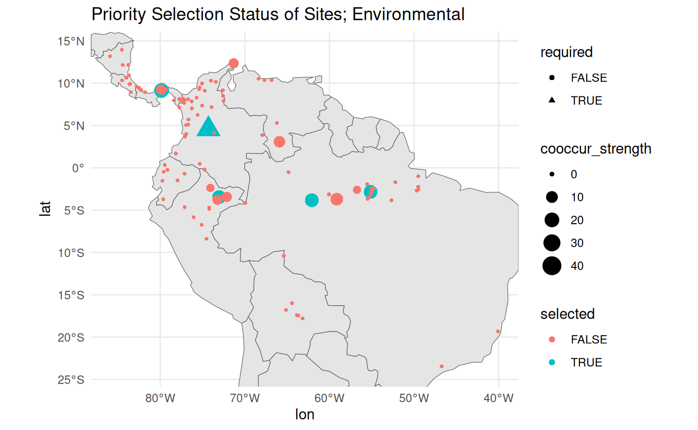

# Rare Species Sampling Schema

`safeHavens` includes one function for population-level data.

## prepare data

Load the required packages.

``` r
library(safeHavens)
library(ggplot2)
library(patchwork)
set.seed(99)
```

For this vignette, we will use the Bradypus data included in the `dismo`
package.

``` r
x <- read.csv(file.path(system.file(package="dismo"), 'ex', 'bradypus.csv'))
x <- x[,c('lon', 'lat')]
x <- sf::st_as_sf(x, coords = c('lon', 'lat'), crs = 4326)
```

We will now create the same base map used in the `GettingStarted`
example. While this chunk is ‘hidden’ in the rendered man pages, it
remains present in the raw vignette documents.

    Warning: attribute variables are assumed to be spatially constant throughout
    all geometries

Unlike other functions in the package that use sf objects, this function
instead uses a simple site data frame for more efficient calculations.

The `KMedoidsBasedSample` function requires a list as input, consisting
of two elements: (1) a distance matrix, and (2) a data frame containing
site locations and relevant attributes. Ensure both elements are present
when calling this function. The required columns in the data frame are:
site_id, coord_uncertainty, lon, and lat. Please verify your data frame
includes each of these columns to ensure proper function performance.

``` r
n_sites <- nrow(x) 
df <- data.frame(
  site_id = seq_len(n_sites),
  required = FALSE,
  coord_uncertainty = 0, 
  lon = sf::st_coordinates(x)[,1], 
  lat = sf::st_coordinates(x)[,2]
)

knitr::kable(head(df))
```

| site_id | required | coord_uncertainty |      lon |      lat |
|--------:|:---------|------------------:|---------:|---------:|
|       1 | FALSE    |                 0 | -65.4000 | -10.3833 |
|       2 | FALSE    |                 0 | -65.3833 | -10.3833 |
|       3 | FALSE    |                 0 | -65.1333 | -16.8000 |
|       4 | FALSE    |                 0 | -63.6667 | -17.4500 |
|       5 | FALSE    |                 0 | -63.8500 | -17.4000 |
|       6 | FALSE    |                 0 | -64.4167 | -16.0000 |

The distance matrix, which is the second required element of the input
list, can be generated using the `greatCircleDistance` function from
this package. Use this instead of
[`sf::st_distance`](https://r-spatial.github.io/sf/reference/geos_measures.html)
to keep unit consistency, as the units differ. If using
[`sf::st_distance`](https://r-spatial.github.io/sf/reference/geos_measures.html),
always convert the units to match those of `greatCircleDistance` to
ensure correct results. As an alternative, you can use an environmental
distance matrix derived from the first two axes of a PCA, as described
in more detail below.

``` r
dist_mat <- sapply(1:nrow(df), function(i) {
   greatCircleDistance(
     df$lat[i], df$lon[i],
     df$lat, df$lon
   )
 })
```

The optimisation routine requires at least one specified site. Here, we
will select the site location closest to the geographic centre of all
sites as the required site.

Normally, this refers to existing accessions, administrative units, or
nature preserves that support the germplasm collection by already
possessing samples or guaranteed access.

``` r
dists2c <- greatCircleDistance(
  median(df$lat), 
  median(df$lon), 
  df$lat, 
  df$lon
)
df[order(dists2c)[1],'required'] <- TRUE
```

This function bootstraps sites to simulate the species’ true
distribution and bootstraps coordinate uncertainty for each site. Here,
we will randomly assign 20% of the sites to have coordinate uncertainty
ranging from 1 km to 40 km. Coordinate uncertainty is always measured in
meters.

``` r
uncertain_sites <- sample(
  setdiff(seq_len(n_sites), 
  which(df$required)), 
  size = round(n_sites*0.2, 0)
  )
df$coord_uncertainty[uncertain_sites] <- runif(length(uncertain_sites), 1000, 40000) # meters
```

## Run KMedoidsBasedSample based only on geographic distances

The function takes two inputs: a distance matrix and site data.

``` r
test_data <- list(
  distances = dist_mat,
  sites = df
  )

str(test_data)
List of 2
 $ distances: num [1:116, 1:116] 0 1.83 714.09 807.71 797.93 ...
 $ sites    :'data.frame':  116 obs. of  5 variables:
  ..$ site_id          : int [1:116] 1 2 3 4 5 6 7 8 9 10 ...
  ..$ required         : logi [1:116] FALSE FALSE FALSE FALSE FALSE FALSE ...
  ..$ coord_uncertainty: num [1:116] 0 0 0 0 0 ...
  ..$ lon              : num [1:116] -65.4 -65.4 -65.1 -63.7 -63.9 ...
  ..$ lat              : num [1:116] -10.4 -10.4 -16.8 -17.4 -17.4 ...
```

The function `KMedoidsBasedSample` has several arguments used to control
run parameters.

``` r
st <- system.time( {
    geo_res <- KMedoidsBasedSample( 
       ## reduce params from defaults
       ##  for a quick run. 

      input_data = test_data,
      n = 5,
      n_bootstrap = 10,
      dropout_prob = 0.1,
      n_local_search_iter = 10,
      n_restarts = 2
    )
  }
)
Sites: 116 | Seeds: 1 | Requested: 5 | Coord. Uncertain: 19 | BS Replicates: 10
  |                                                                              |                                                                      |   0%  |                                                                              |=======                                                               |  10%  |                                                                              |==============                                                        |  20%  |                                                                              |=====================                                                 |  30%  |                                                                              |============================                                          |  40%  |                                                                              |===================================                                   |  50%  |                                                                              |==========================================                            |  60%  |                                                                              |=================================================                     |  70%  |                                                                              |========================================================              |  80%  |                                                                              |===============================================================       |  90%  |                                                                              |======================================================================| 100%
```

The function runs quickly with a few bootstrap or site samples, but it
will take longer with more complex scenarios. We recommend using at
least 999 bootstraps for real-world applications.

``` r
knitr::kable(st)
```

|            |      x |
|:-----------|-------:|
| user.self  | 26.797 |
| sys.self   |  0.053 |
| elapsed    | 26.858 |
| user.child |  0.000 |
| sys.child  |  0.000 |

### return output structure

Five objects are returned by the function.

``` r
str(geo_res)
List of 5
 $ input_data     :'data.frame':    116 obs. of  10 variables:
  ..$ site_id          : int [1:116] 47 21 5 83 100 6 106 19 95 86 ...
  ..$ required         : logi [1:116] TRUE FALSE FALSE FALSE FALSE FALSE ...
  ..$ coord_uncertainty: num [1:116] 0 0 0 37284 13617 ...
  ..$ lon              : num [1:116] -74.3 -55.1 -63.9 -79.8 -74.1 ...
  ..$ lat              : num [1:116] 4.58 -2.83 -17.4 9.17 -2.37 ...
  ..$ certain          : logi [1:116] FALSE FALSE FALSE FALSE FALSE FALSE ...
  ..$ cooccur_strength : num [1:116] 40 28 24 20 20 16 16 12 12 8 ...
  ..$ is_seed          : logi [1:116] TRUE FALSE FALSE FALSE FALSE FALSE ...
  ..$ selected         : logi [1:116] TRUE TRUE FALSE TRUE FALSE TRUE ...
  ..$ sample_rank      : int [1:116] 1 2 3 4 4 5 5 6 6 7 ...
 $ selected_sites : int [1:5] 6 21 47 83 106
 $ stability_score: num 0.2
 $ stability      :'data.frame':    116 obs. of  3 variables:
  ..$ site_id         : int [1:116] 47 21 5 83 100 6 106 19 95 86 ...
  ..$ cooccur_strength: num [1:116] 40 28 24 20 20 16 16 12 12 8 ...
  ..$ is_seed         : logi [1:116] TRUE FALSE FALSE FALSE FALSE FALSE ...
 $ settings       :'data.frame':    1 obs. of  4 variables:
  ..$ n_sites     : num 5
  ..$ n_bootstrap : num 10
  ..$ dropout_prob: num 0.1
  ..$ n_uncertain : int 19
```

The stability score shows how often the most frequently selected network
of sites was selected from the bootstrapped runs.

``` r
knitr::kable(head(geo_res$stability_score))
```

|   x |
|----:|
| 0.2 |

The stability data frame records how many times each site is selected
during all bootstrap runs.

``` r
knitr::kable(head(geo_res$stability))
```

|     | site_id | cooccur_strength | is_seed |
|:----|--------:|-----------------:|:--------|
| 47  |      47 |               40 | TRUE    |
| 21  |      21 |               28 | FALSE   |
| 5   |       5 |               24 | FALSE   |
| 83  |      83 |               20 | FALSE   |
| 100 |     100 |               20 | FALSE   |
| 6   |       6 |               16 | FALSE   |

Many users may find that combining their input data with a few columns
is all they need to continue after the results.

``` r
knitr::kable(head(geo_res$input_data))
```

|     | site_id | required | coord_uncertainty |      lon |      lat | certain | cooccur_strength | is_seed | selected | sample_rank |
|:----|--------:|:---------|------------------:|---------:|---------:|:--------|-----------------:|:--------|:---------|------------:|
| 47  |      47 | TRUE     |              0.00 | -74.3000 |   4.5833 | FALSE   |               40 | TRUE    | TRUE     |           1 |
| 21  |      21 | FALSE    |              0.00 | -55.1333 |  -2.8333 | FALSE   |               28 | FALSE   | TRUE     |           2 |
| 5   |       5 | FALSE    |              0.00 | -63.8500 | -17.4000 | FALSE   |               24 | FALSE   | FALSE    |           3 |
| 83  |      83 | FALSE    |          37283.66 | -79.8167 |   9.1667 | FALSE   |               20 | FALSE   | TRUE     |           4 |
| 100 |     100 | FALSE    |          13616.63 | -74.0833 |  -2.3667 | FALSE   |               20 | FALSE   | FALSE    |           4 |
| 6   |       6 | FALSE    |              0.00 | -64.4167 | -16.0000 | FALSE   |               16 | FALSE   | TRUE     |           5 |

Run parameters are saved in the settings element.

``` r
knitr::kable(head(geo_res$settings))
```

| n_sites | n_bootstrap | dropout_prob | n_uncertain |
|--------:|------------:|-------------:|------------:|
|       5 |          10 |          0.1 |          19 |

### visualise the selection results

We can plot the required and selected site locations.

``` r
map + 
  geom_point(data = geo_res$input_data, 
  aes(
    x = lon, 
    y = lat, 
    shape = required, 
    size = cooccur_strength,
    color = selected
    )
  ) +
 # ggrepel::geom_label_repel(aes(label = site_id), size = 4) + 
  theme_minimal() + 
  labs(title = 'Priority Selection Status of Sites; Geographic Distances')
```


As you can see, a couple of alternative sites in very close proximity to
the selected sites also score highly. These alternatives could be used
as substitutes for the target sites. What is important is that these
combinations are found and articulated in the results for site
locations.

``` r
map + 
  geom_point(data = geo_res$input_data, 
    aes(
      x = lon, 
      y = lat, 
      shape = required, 
      size = -sample_rank,
      color = sample_rank
      )
    ) +
 # ggrepel::geom_label_repel(aes(label = sample_rank), size = 4) +
  theme_minimal()   
```


Because we believe that as many populations as possible should be
sampled, we include a ‘priority’ ranking with the results. The focus
should be on the selected sites, but opportunities to sample beyond them
should not be overlooked.

## run KMedoidsBasedSample with environmental distances

As mentioned, instead of using geographic distance, we can use
environmental distance, which is ordinated in a two-dimensional space.
An analyst should only consider variables they know are relevant to the
species distribution for this purpose. However, for the sake of the
example, we will feed in the full stack of environmental variables
available from the dismo package.

### extract prep environmental distances

First, to facilitate environmental distance calculations, we read in the
required raster layers.

``` r
files <- list.files(
  path = file.path(system.file(package="dismo"), 'ex'), 
  pattern = 'grd',  full.names=TRUE )
predictors <- terra::rast(files) # import the independent variables
rm(files)
```

For our environmental distances, we will use a PCA transformation of the
environmental variables. We will sample 100 random points from the
raster layers to calculate the PCA, and then predict the PCA raster
layers across the entire study area. We will take only the first two
layers from the PCA and calculate environmental distances based on them.

``` r
pts <- terra::spatSample(predictors, 100, na.rm = TRUE)
pts <- pts[, names(pts)!='biome' ] # remove categorical variable for distance calc

pca_results <- stats::prcomp(pts, scale = TRUE)
round(pca_results$sdev^2 / sum(pca_results$sdev^2), 2) # variance explained
[1] 0.58 0.26 0.10 0.04 0.02 0.00 0.00 0.00
pca_raster <- terra::predict(predictors, pca_results)
```

From the above, we see that the first two PCA axes account for a large
portion of the variance observed in this landscape.

``` r
terra::plot(terra::subset(pca_raster, c(1:2))) # prediction of the pca onto a new raster
```


We keep the first two PCA layers for calculating the environmental
distance. Including more layers increases dimensionality and may reduce
the usefulness of the results. Note that it’s fine to use a Euclidean
distance calculation for these, as the values are truly in the position
of the pca plot.

``` r
env_values <- terra::extract(pca_raster, 
  sf::st_coordinates(
    sf::st_as_sf(
      df, 
      coords = c('lon', 'lat'), 
      crs = 4326
    )
  )
)[,1:2]
plot(env_values, main = 'environmental distance of points from first two PCA axis')
```


We’ll ensure that these data are in a proper matrix format for feeding
into the function.

``` r
env_dist_mat <- as.matrix(
    dist(env_values)
  )
```

Similar to the above run with geographic distances, we create our input
object and run the function.

``` r
test_data <- list(
  distances = env_dist_mat,
  sites = df
  )

st <- system.time( 
  {
    env_res <- KMedoidsBasedSample(  ## reduce some parameters for shorter run time.
      input_data = test_data,
      n = 5,
      n_bootstrap = 10,
      dropout_prob = 0.1,
      n_local_search_iter = 50,
      n_restarts = 2
    )
  }
)
Sites: 116 | Seeds: 1 | Requested: 5 | Coord. Uncertain: 19 | BS Replicates: 10
  |                                                                              |                                                                      |   0%  |                                                                              |=======                                                               |  10%  |                                                                              |==============                                                        |  20%  |                                                                              |=====================                                                 |  30%  |                                                                              |============================                                          |  40%  |                                                                              |===================================                                   |  50%  |                                                                              |==========================================                            |  60%  |                                                                              |=================================================                     |  70%  |                                                                              |========================================================              |  80%  |                                                                              |===============================================================       |  90%  |                                                                              |======================================================================| 100%

rm(dist_mat, env_dist_mat)
```

This run takes longer than the runs with only the geographic distance
matrix.

``` r
knitr::kable(st)
```

|            |      x |
|:-----------|-------:|
| user.self  | 35.192 |
| sys.self   |  0.001 |
| elapsed    | 35.203 |
| user.child |  0.000 |
| sys.child  |  0.000 |

The environmental distance run takes about 10 seconds longer.

``` r
knitr::kable(head(env_res$stability_score))
```

|   x |
|----:|
| 0.2 |

The overall stability score is similar to that of the geographic score.
When you view the plots, you will see that a handful of sites in close
proximity to the selected sites would have served as nearly equivalent
substitutes. A few areas have dropped out of priority sampling based on
this method, but in general, the results are pretty similar - the
relationship between geographic and environmental distance is somewhat
strong in this landscape.

``` r
map + 
  geom_point(data = env_res$input_data, 
    aes(
      x = lon, 
      y = lat, 
      shape = required, 
      size = cooccur_strength,
      color = selected
      )
    ) +
 # ggrepel::geom_label_repel(aes(label = site_id), size = 4) + 
  theme_minimal() + 
  labs(title = 'Priority Selection Status of Sites; Environmental')
```



## alternative methods for required central points

In the example above, we use a point at the median geographic centre of
the population.

We can also identify the population with the highest population density.
Intuitively, this would suggest a population with high genetic diversity
for the species, although it is unlikely to have accumulated substantial
local changes, as the effects of drift are overcome by more frequent
dispersal.

``` r
dens <- with(df, MASS::kde2d(lon, lat, n = 200))
max_idx <- which(dens$z == max(dens$z), arr.ind = TRUE)[1,]
max_point <- c(dens$x[max_idx[1]], dens$y[max_idx[2]])

pops_centre <- sweep(df[c('lon', 'lat')], 2, max_point, "-")
pop_centered_id <- which.min(rowSums(abs(pops_centre^2)))

rm(dens, max_idx, max_point, pops_centre)
```

Alternatively, we can identify the population which is closest to the
‘centre’ of the environmental variable space.

``` r
env_centered <- sweep(env_values, 2, sapply(env_values, median), "-")
env_centered_id <- which.min(rowSums(abs(env_centered^2)))

rm(env_values)
```

Personally, I would consider the ‘pop-centred’ population to be the most
important site to centre a design. However, it can suffer from sampling
bias, and you may want to check that the recorded populations are
deduplicated to account for this.

``` r
# geographic centroid was pt 47
centers <- df[ c(env_centered_id, pop_centered_id, 47), ] 
centers$type <- c('Environmental', 'Population', 'Geographic')

map +
  geom_point(
    data = df, 
    aes(x = lon, y = lat)
    ) + 
  geom_point(
    data = centers,  
    aes(x = lon, y = lat),
    col = '#FF1493', size = 4
    ) + 
 # ggrepel::geom_label_repel(
 #   data = centers, 
 #   aes(label = type, x = lon, y = lat)
 #   ) + 
  theme_minimal() + 
  labs(title = 'Possbilities for centers')
```


