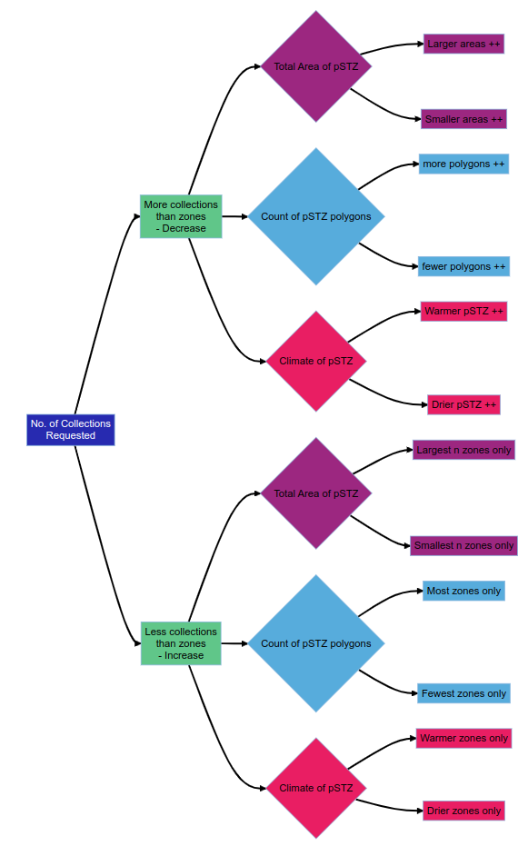

A variety of methods exist for implementing naive sampling schemes for polygon-based products, such as provisional and empirical Seed Transfer Zones (pSTZs and eSTZs), as well as Ecoregion (e.g., Omernik or Baileys).
The sampling of these products is implemented using a single function, safeHavens `PolygonBasedSample`, which considers environmental traits of seed transfer zones and the size and number of polygon patches for both ecoregions and STZs.

The function requires modes for two main scenarios: when a user wants **more** collections than zones exist in the data, the function needs to use an 'increase' method.
When a user wants **fewer** collections than there are zones, a decrease method needs to be implemented.
Three options are available for both scenarios.

1) number of polygons per class
2) total area of each class
3) simple climate parameters for each class

Additionally, this function can be applied to the clusters identified by the Isolation by Distance, Resistance, and Environmental workflows when a user wants to decouple the clustering process from the number of samples.

See `?PolygonBasedSample` for notes on implementation.
